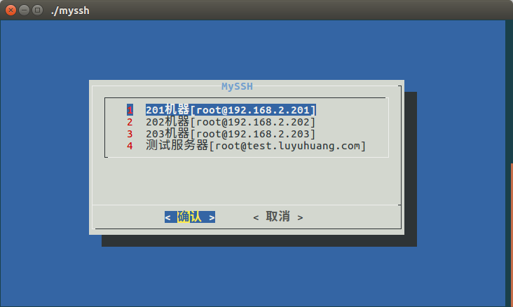
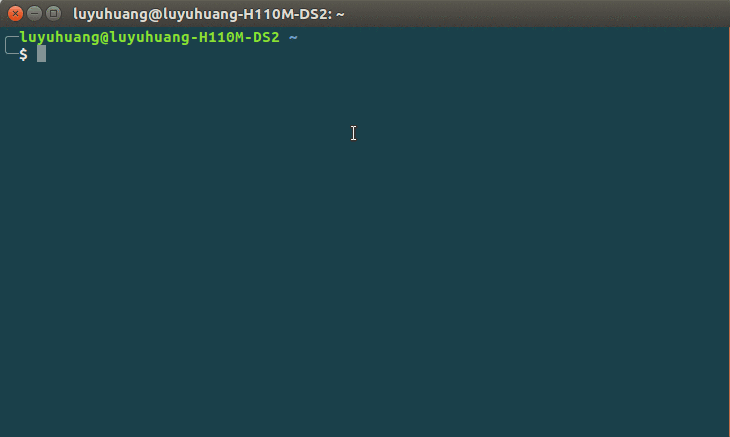
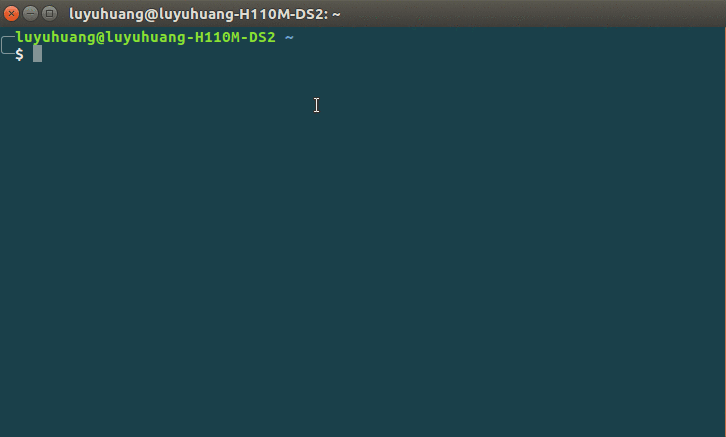

# MySSH
A tool that make you to use SSH more gracefully



### Install
Create a symbolic link in /usr/local/bin to point to the myssh script

e.g.
```bash
cd ~
git clone git@github.com:luyuhuang/myssh.git
sudo ln -s /home/$(whoami)/myssh/myssh /usr/local/bin/myssh
```

enjoy it!

### Usage

enter myssh:        `myssh`

print help:         `myssh -h`

print config file:  `myssh -l`

edit config file:   `myssh -e`

copy file:          `myssh -c`


#### SSH to remove host:


#### Copy file from remove host:

